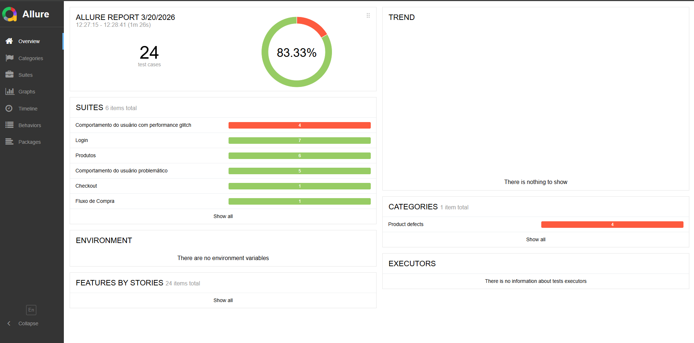

# Automação E2E - Swag Labs


Projeto de automação de testes End‑to‑End utilizando **Cypress + Cucumber (BDD)** com execução em **Docker** e **pipeline CI no Jenkins (Multibranch)**.

Este projeto demonstra uma arquitetura profissional de automação com separação de responsabilidades, massa de dados externa e execução contínua em pipeline.

---

# 📌 Tecnologias utilizadas

* Cypress
* Cucumber (BDD)
* JavaScript
* Node.js
* Docker
* Jenkins (Multibranch Pipeline)
* Page Object Model
* JSON para massa de dados
* Allure Report

---
### Features

Contém os cenários escritos em **BDD (Gherkin)**.

Exemplo:
```gherkin
Cenário: Adiciona produto ao carrinho
  Dado que estou na página de produtos
  Quando seleciono um produto "backpack"
  Então devo visualizar o produto no carrinho
```

---

# 🏗️ Arquitetura de automação

O projeto utiliza uma divisão de responsabilidades:

### elements

Contém apenas **seletores da página**.
```
nomeProdutoLabel() {
  return cy.get('[data-test="inventory-item-name"]')
}
```

### actions

Contém **ações reutilizáveis** executadas nos testes.
```
selecionarProduto(nomeProduto) {
  produtosElements.nomeProdutoLabel()
    .contains(nomeProduto)
    .click()
}
```

### steps

Contém a implementação dos passos do **Cucumber**.
```
When("seleciono um produto {string}", (produtoKey) => {
  const nomeProduto = produtos[produtoKey].nome
  produtosActions.selecionarProduto(nomeProduto)
})
```

### fixtures

Contém **massa de dados em JSON**.
```
{
  "backpack": {
    "nome": "Sauce Labs Backpack",
    "preco": "$29.99"
  }
}
```

---

# 🧩 Instalação do projeto

### 1️⃣ Clonar repositório
```
git clone https://github.com/loopfagundes/automacao-e2e-swaglab.git
```

### 2️⃣ Instalar dependências
```
npm install
```

---

# ⚙️ Executar testes

### Modo interativo (Cypress UI - E2E Testing)
```
npx cypress open
```

### Modo headless
```
npx cypress run
```

**NOTA:** *Às vezes, ao rodar os testes, eles não passam por causa de problemas de performance é necessário medir o tempo de carregamento.*

---

# 🏷️ Tags

O projeto utiliza tags para organizar e filtrar a execução dos testes.

### Tags disponíveis

| Tag | Descrição |
|---|---|
| `@smoke` | Fluxos críticos, execução rápida |
| `@regressivo` | Todos os cenários completos |

> 💡 As demais tags disponíveis estão nos arquivos `.feature` do projeto.

### Como usar no `.feature`
```gherkin
@regressivo
@performance
@smoke
Funcionalidade: Comportamento do usuário com performance glitch
  Como um usuário autenticado
  Quero verificar o comportamento do usuário com performance glitch
  Para entender as limitações e peculiaridades desse tipo de usuário

    Contexto: Login com usuário com performance glitch
        Dado que estou na página de login
        Quando faço login com usuário performance glitch
        Então clico no botão de login

    @performance_001
    Cenário: Validar tempo de carregamento no login
        Então o tempo de carregamento deve ser menor que "40" ms
```

### Executar por tag
```
npm run test:smoke
```
```
npm run test:regressivo
```

Ou diretamente pelo Cypress:
```
npx cypress run --env tags=@smoke
```
```
npx cypress run --env tags=@regressivo
```

### Combinar tags
```
npx cypress run --env tags="@smoke and @login"
```
```
npx cypress run --env tags="@smoke or @regressivo"
```
```
npx cypress run --env tags="not @smoke"
```

---

# 🐳 Execução com Docker

### Como configurar o ambiente?
[**README-INFRA**](https://github.com/loopfagundes/automacao-e2e-bugbank/blob/main/README-INFRA.md)
 
- [Instalar Docker](https://github.com/loopfagundes/automacao-e2e-bugbank/blob/main/README-INFRA.md#-instalar-docker)
- [Subir Jenkins via Docker](https://github.com/loopfagundes/automacao-e2e-bugbank/blob/main/README-INFRA.md#-subir-jenkins-via-docker) 

---

# 🧪 Pipeline Jenkins

### Container
```
jenkins
```

### Comando:
```
docker start jenkins

docker stop jenkins
```

O projeto utiliza **Jenkins Multibranch Pipeline** com execução dentro de container Docker.

Fluxo do pipeline:
```
Checkout código
     ↓
Instalar dependências
     ↓
Executar testes Cypress
     ↓
Publicar artefatos
```

### Parâmetros do pipeline

O pipeline aceita parâmetros para customizar a execução dos testes diretamente pelo Jenkins.

| Parâmetro | Tipo | Default | Descrição |
|---|---|---|---|
| `CUCUMBER_TAG` | string | `@regressivo` | Tag do Cucumber para filtrar os testes |
| `BROWSER` | choice | `chrome` | Browser para rodar os testes |

### Como executar com parâmetros?

1. Acesse o job no Jenkins
2. Clique na branch desejada para executar
3. Clique em **"Build with Parameters"** ou **"Construir com parâmetros"**
4. Selecione o browser desejado
5. Informe a tag desejada
6. Clique em **"Build"** ou **"Construir"**

### Exemplos de tags
```
@smoke        → executa apenas os fluxos críticos
@regressivo   → executa todos os cenários
@login        → executa apenas os cenários de login
@performance  → executa apenas os cenários de performance
```

> 💡 As demais tags disponíveis estão nos arquivos `.feature` do projeto.

---

# 🌐 Ngrok

O projeto utiliza o **Ngrok** para expor o Jenkins local publicamente, permitindo acessar o pipeline de qualquer lugar via URL temporária.

### Instalação

1. Acesse [ngrok.com](https://ngrok.com) e crie uma conta gratuita
2. Baixe e instale o Ngrok
3. Autentique com o token da sua conta:
```
ngrok config add-authtoken SEU_TOKEN_AQUI
```

### Expor o Jenkins

O Jenkins roda na porta `8080` por padrão:
```
ngrok http 8080
```

O Ngrok vai gerar uma URL pública:
```
Forwarding  https://abc123.ngrok-free.dev -> http://localhost:8080
```

### Acessar o Jenkins remotamente
```
https://abc123.ngrok-free.dev
```

> ⚠️ **Atenção:** No plano gratuito a URL muda a cada reinício do Ngrok. Mantenha o terminal aberto enquanto estiver utilizando.

| Limitação | Detalhe |
|---|---|
| URL temporária | Muda a cada reinício |
| 1 túnel simultâneo | Apenas um serviço exposto |
| Sessão ativa | Terminal deve permanecer aberto |

---
# 📊 Allure Report

Comando: 
```
npx rimraf allure-results allure-report
```
É utilizado para excluir os resultados e relatórios anteriores dos testes Allure antes de executar um novo conjunto de testes.
```
npx allure generate ./allure-results -o ./allure-report --clean && allure open ./allure-report
```
Esse comando serve para transformar os dados brutos de execução dos seus testes em um relatório visual (HTML) e abri-lo automaticamente no navegador

### Evidência
