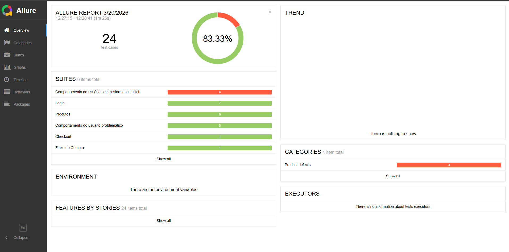

# Automação E2E - Swag Labs

Projeto de automação de testes End‑to‑End utilizando **Cypress + Cucumber (BDD)** com execução em **Docker** e **pipeline CI no Jenkins (Multibranch)**.

Este projeto demonstra uma arquitetura profissional de automação com separação de responsabilidades, massa de dados externa e execução contínua em pipeline.

---

# 📌 Tecnologias utilizadas

* Cypress
* Cucumber (BDD)
* JavaScript
* Node.js
* Docker
* Jenkins (Multibranch Pipeline)
* Page Object Model
* JSON para massa de dados

---
### Features

Contém os cenários escritos em **BDD (Gherkin)**.

Exemplo:

```gherkin
Cenário: Adiciona produto ao carrinho
  Dado que estou na página de produtos
  Quando seleciono um produto "backpack"
  Então devo visualizar o produto no carrinho
```

---

# 🏗️ Arquitetura de automação

O projeto utiliza uma divisão de responsabilidades:

### elements

Contém apenas **seletores da página**.

```
nomeProdutoLabel() {
  return cy.get('[data-test="inventory-item-name"]')
}
```

### actions

Contém **ações reutilizáveis** executadas nos testes.

```
selecionarProduto(nomeProduto) {
  produtosElements.nomeProdutoLabel()
    .contains(nomeProduto)
    .click()
}
```

### steps

Contém a implementação dos passos do **Cucumber**.

```
When("seleciono um produto {string}", (produtoKey) => {
  const nomeProduto = produtos[produtoKey].nome
  produtosActions.selecionarProduto(nomeProduto)
})
```

### fixtures

Contém **massa de dados em JSON**.

```
{
  "backpack": {
    "nome": "Sauce Labs Backpack",
    "preco": "$29.99"
  }
}
```

---

# 🧩 Instalação do projeto

### 1️⃣ Clonar repositório

```
git clone https://github.com/loopfagundes/automacao-e2e-swaglab.git
```

### 2️⃣ Instalar dependências

```
npm install
```

---

# ⚙️ Executar testes

### Modo interativo (Cypress UI - E2E Testing)

```
npx cypress open
```

### Modo headless

```
npx cypress run
```

**NOTA:** *Às vezes, ao rodar os testes, eles não passam por causa de problemas de performance é necessário medir o tempo de carregamento.*

---

# 🐳 Execução com Docker

### Como configurar o ambiente?
[**README-INFRA**](https://github.com/loopfagundes/automacao-e2e-bugbank/blob/main/README-INFRA.md)
 
- [Instalar Docker](https://github.com/loopfagundes/automacao-e2e-bugbank/blob/main/README-INFRA.md#-instalar-docker)
- [Subir Jenkins via Docker](https://github.com/loopfagundes/automacao-e2e-bugbank/blob/main/README-INFRA.md#-subir-jenkins-via-docker) 

---

# 🧪 Pipeline Jenkins

### Container

```
jenkins
```

### Comando:

```
docker start jenkins

docker stop jenkins
```

O projeto utiliza **Jenkins Multibranch Pipeline** com execução dentro de container Docker.

Fluxo do pipeline:

```
Checkout código
     ↓
Instalar dependências
     ↓
Executar testes Cypress
     ↓
Publicar artefatos
```

---

# 📊 Allure Report

Comando: 

```
npx rimraf allure-results allure-report
```
É utilizado para excluir os resultados e relatórios anteriores dos testes Allure antes de executar um novo conjunto de testes.

```
npx allure generate ./allure-results -o ./allure-report --clean && allure open ./allure-report
```
Esse comando serve para transformar os dados brutos de execução dos seus testes em um relatório visual (HTML) e abri-lo automaticamente no navegador

### Evidência
 

